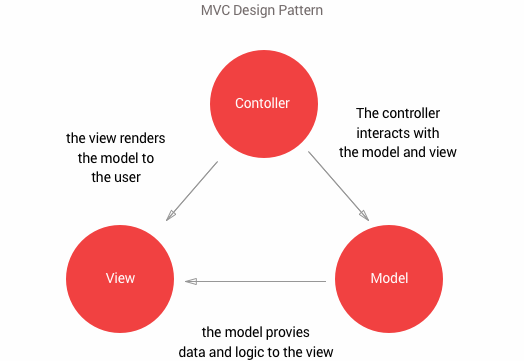

One of the most well known design pattern is the Model View Controller (MCV). This design pattern is concerned with the separation of logic, data models, and presentation. Making your code more readable and maintainable. 

